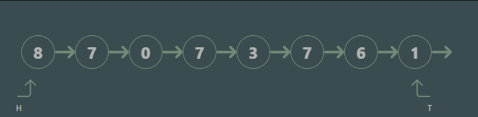
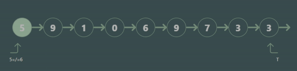

# Algorithm Visualizer

##### This is an algorithm visualizer that helps visualize algorithms such as Linkedlist, Binary Search Tree, Sorting, Pathfinding, etc.

## Table of Contents

- [Who is this for?](#who-is-this-for)
- [Demo](#demo)
- [Project Specificastion](#project-specificastion)
- [Want to Contribute?](#want-to-contribute)
- [Pull Request Review](#pull-request-review)
- [Find a Bug](#find-a-bug)
- [What's Next?](#whats-next)

## Who is this for?

This project is an instructive platform where students, teachers, and professionals can come and learn the different algorithms.

- The platform helps break down each step of the algorithm, and creates visuals at the same time.
- Code is generated as each algorithm plays, and creates explanations for each step.
- This project currently consists of the linked list Algorithm, more algorithms will be added.

## Project Specificastion

This Project is adopted from the following:

- [Github](https://github.com/nh124/DataAlgorithmVisualizer)
- [Live Site](https://nh124.github.io/DataAlgorithmVisualizer/)

  ### The following still needs to be implemented:

  - Animation for Add, Delete, Search
  - Testing is covered for linked list class, rest need to implemented.

## Demo

- The 2 videos below show the delete, and search functions
<div style="display: flex;">
  <div style="margin-right: 10px;">
    <h2>Delete</h2>
    
  </div>
  <div>
    <h2>Searching</h2>
    
  </div>
</div>

## Want to contribute?

- This project is mainly being developed in
  - [React-Typescript](https://www.typescriptlang.org/docs/handbook/react.html)
  - [Tailwind CSS](https://tailwindcss.com/)
  - [Vite](https://vitejs.dev/).
- Please be sure you have [Node](https://nodejs.org/en) installed on your operating system.
- Select any issue/feature that is present, and assign yourself.
- Fork the DataAlgorithmVisualizer repo.
- In your forked repository, make your changes in a new git branch. Add the issue, or feature in place of <issue/feature_name>:
  ```bash
  git checkout -b <issue/feature_name>
  ```
- Use ESLint to lint, and typescript-ts to test your code before building.
- Commit all changes. Please be descriptive with your commit message
  ```bash
  git commit -m --all
  ```
- Push branch to GitHub
  ```bash
  git push origin <issue/feature_name>
  ```
- This project is utilizing github workflow. So after each PR, all the tests will run, and the project will be built to make sure your core is error free.

## Pull request review

Please write a test for each pull request if it's not already present. If the test file is missing the Pull request will not be accepted.

### Addressing review feedback

If we ask for changes via code reviews then:

- Make the required updates to the code.
- Rerun the ESLint, typescript-ts to ensure all tests are passing, and changes are properly linked.
- Create a fixup commit and push to your GitHub repository (this will update your Pull Request):
  ```bash
  git commit --all --fixup HEAD
  git push
  ```

## Find a bug

- Please create an issue and mention where the bug was found.
- Provide steps to reproduce, and provide a screenshot/video.

## What's next?

The project is still in its early stages. We have the following algorithm visualizers planned:

- Linked List Traversal
- Binary Search Tree Traversal
- Depth for Search, and Breath for Search
- Path-Finding Algorithm
- Sorting Algorithm
- [Link to the deployed](https://nh124.github.io/AlgorithmVisualizer/)

Feel free to add any algorithms, or features in the issues page.
